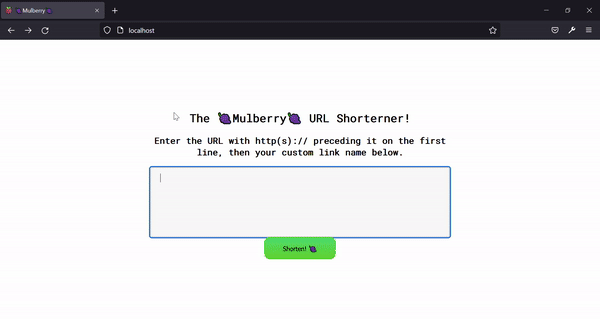
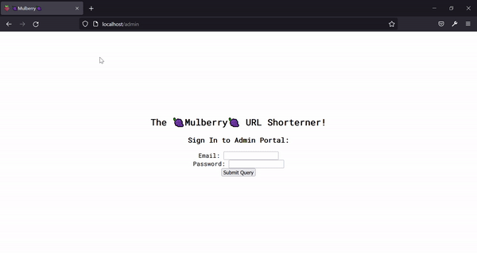

## Mulberry 🍇

This is a URL Shortener Project called Mulberry. Maybe one day it can go big? 

---

### Things to Implement:
- Will Implement Analytics 
- Increase Cybersecurity (Extremely vulnerable to SQLi and Auth Skip now)
- Restrictions on click count, like a self-destroying url only available once
- IP Logging and Protection
- Tidy up the CSS and HTML

---

### Gallery:

Regular Usage:  

 

Admin Portal:  

 

